# KORUVISION — Cadeia Narrativa Frame-a-Frame (Continuidade Total)

> Cada **frame final** de uma cena = **frame inicial** da próxima.  
> O visitante nunca deve sentir um corte — apenas evolução.

---

## Diagrama da jornada

```mermaid
flowchart TD
  C01["C01 Hero\nOrbe desperta → CRM emerge"]
  C02["C02 Coruja\nOlhos abrem"]
  C03["C03 Caos\nFragmentos dispersos"]
  C04["C04 Pilares\nOrdem emerge"]
  C05["C05 Demo\nCRM desperta F2F"]
  C06["C06 Setup\nPortais conectam"]
  C07["C07 IA\nCérebro ativa"]
  C08["C08 Inbox\nMensagens fluem"]
  C09["C09 Funil\nDeal avança"]
  C10["C10 Auto\nSinapses disparam"]
  C11["C11 Analytics\nDados evoluem"]
  C12["C12 Benefícios\nConstelação"]
  C13["C13 Antes/Depois\nDivisão"]
  C14["C14 Cases\nVerticais"]
  C15["C15 Social\nAgregação"]
  C16["C16 Integrações\nÓrbita"]
  C17["C17 Agência\nPortal"]
  C18["C18 Planos\nEscolha"]
  C19["C19 CTA\nConvergência"]

  C01 -->|"brilho central → olhos"| C02
  C02 -->|"olhar penetra névoa"| C03
  C03 -->|"fragmentos → pilares"| C04
  C04 -->|"zoom pilar → interior"| C05
  C05 -->|"botão Conectar → portal"| C06
  C06 -->|"portal violeta → cérebro"| C07
  C07 -->|"node WA → inbox"| C08
  C08 -->|"deal card → funil"| C09
  C09 -->|"fechamento → pulso"| C10
  C10 -->|"nodes → dashboard"| C11
  C11 -->|"zoom out → estrelas"| C12
  C12 -->|"split → dois mundos"| C13
  C13 -->|"lado bom expande"| C14
  C14 -->|"métricas somam"| C15
  C15 -->|"stats orbitam"| C16
  C16 -->|"zoom core → portal"| C17
  C17 -->|"portal abre → planos"| C18
  C18 -->|"cards dissolvem"| C19
```

---

## Tabela de continuidade (frame final → frame inicial)

| De | Frame FINAL (progress 1.0) | Para | Frame INICIAL (progress 0.0) | Mecanismo técnico |
|----|---------------------------|------|-------------------------------|-------------------|
| C01→C02 | Orbe emite flash gold central; CRM opacity 0.9 no canto | C02 | Escuridão com dois pontos amber (olhos fechados) no **mesmo centro visual** | `handoff-glow` opacity 0→0.55; crossfade BG hue 265 |
| C02→C03 | Olhos abertos, pupila fixa, tunnel mask 40% radius | C03 | Névoa vermelha irradia **da pupila** para fora | `visionTunnelMask` expand; hue shift 265→8 |
| C03→C04 | Fragmentos comprimidos em 4 clusters no centro | C04 | 4 pilares emergem dos 4 clusters | Flip fragmentos → pilares |
| C04→C05 | Câmera dentro do pilar central (violet void) | C05 | Ponto de luz branco (F2F frame 0) no mesmo void | Zoom scale 1.4→match F2F |
| C05→C06 | Dashboard ato 5: botão "Conectar WhatsApp" em glow cyan | C06 | Primeiro portal alinhado ao botão (mesma posição XY) | Match cut UI element |
| C06→C07 | Energia do portal central viaja para frente (violet trail) | C07 | Cérebro neural acende no ponto de chegada da energia | MotionPath partícula |
| C07→C08 | Node "WhatsApp" expande fullscreen | C08 | Coluna esquerda inbox = node expandido | Scale match WhatsApp node |
| C08→C09 | Card deal R$ 2.400 destacado, translate right | C09 | Mesmo card entra no topo do funil 3D | Flip card → pipeline deal |
| C09→C10 | Deal na coluna "Fechado" pulsa gold | C10 | Pulso vira energia no primeiro node "Lead" | Particle burst bridge |
| C10→C11 | Todos nodes convergem para ponto central | C11 | Ponto vira origem do gráfico (frame 0 F2F vazio) | Scale down nodes → chart origin |
| C11→C12 | Dashboard denso; zoom out câmera | C12 | Estrelas/benefícios nas posições dos KPIs | KPI positions → star map |
| C12→C13 | Constelação divide em hemisférios | C13 | Slider no centro; esquerda caos, direita ordem | Split at constellation axis |
| C13→C14 | Lado "depois" ocupa 75% viewport | C14 | Totens emergem do lado direito | Wipe reveal |
| C14→C15 | Métricas dos 5 cards voam para centro | C15 | 4 stats recebem métricas voando | MotionPath metrics |
| C15→C16 | Stats formam círculo orbital | C16 | Círculo vira anel interno do Nexus CRM | Morph ring |
| C16→C17 | Zoom no core CRM | C17 | Core vira portal threshold agência | Scale + portal iris |
| C17→C18 | Portal abre para sala ampla | C18 | 3 monólitos pricing na sala | Camera dolly out |
| C18→C19 | Cards pricing dissolvem em partículas gold | C19 | Partículas convergem (F2F frame 0 void) | Particle dissolve → F2F |

---

## Continuidade por elemento persistente

| Elemento | Presente em | Evolução |
|----------|-------------|----------|
| **Spine global** | Todas | `GlobalJourneyLayer` — opacidade cresce com `--journey-p` |
| **Feixes energia** | C01–C19 | `JourneySectionBeams` conectam âncoras |
| **Coruja (identidade)** | C01 core → C02 full → C07 brain → C19 climax | Sempre como "visão", nunca decorativa |
| **Lead Maria S.** | C05 → C08 → C09 → C11 | Mesma deal R$ 2.400 atravessa narrativa |
| **Pipeline R$** | C01 KPI → C05 dash → C09 → C11 → C15 stat | Número cresce: 152k → 47.8k contexto |
| **Hue energy** | Por ato | Morph gradient entre cenas via `section-morph-bridge` |

---

## Regras de match cut

1. **Posição:** elemento chave no mesmo quadrante (centro-direita) entre cenas
2. **Cor:** transição de hue em ≤800ms via CSS variable `--continuity-hue`
3. **Escala:** objeto saída ≈ escala objeto entrada (±10%)
4. **Luz:** ponto mais brilhante da cena N = origem da luz cena N+1
5. **Som (opcional):** tom sustentado entre handoffs (sem corte seco)

---

## Sequências F2F na cadeia

### NV11-F2F-000 — Hero: Núcleo → CRM (C01)
| Progress | Frame | Narrativa |
|----------|-------|-----------|
| 0.00 | 0 | Orbe fechado, filamentos retraídos |
| 0.25 | 18 | Filamentos expandem; anel iris brilha |
| 0.50 | 36 | Core abre como flor mecânica |
| 0.75 | 54 | Painéis holográficos brotam |
| 1.00 | 71 | CRM operacional visível — **handoff C02** (flash) |

### NV11-F2F-001 — Coruja (C02) ★
| 0.00 | Olhos fechados — **recebe flash C01** |
| 0.50 | Semi-abertos |
| 1.00 | Abertos focados — **handoff C03** (névoa da pupila) |

### NV11-F2F-002 — CRM Despertar (C05)
| 0.00 | Void + ponto luz — **continua void C04** |
| 1.00 | CRM completo — **handoff C06** (botão glow) |

### NV11-F2F-003 — Evolução Dados (C11)
| 0.00 | Gráfico vazio — **nó convergência C10** |
| 1.00 | Dashboard denso — **handoff C12** (zoom out) |

### NV11-F2F-004 — Convergência (C19)
| 0.00 | Void + partículas — **dissolve C18** |
| 1.00 | Coruja + luz estável — loop hold |

---

## Validação de continuidade (checklist por cena)

Antes de aprovar assets de uma cena N:

- [ ] Frame final documentado com screenshot wireframe
- [ ] Frame inicial cena N+1 documentado
- [ ] Mesmo ponto focal (x%, y%) em ambos
- [ ] Hue de transição definida
- [ ] Elemento narrativo (Maria, pipeline, coruja) continua ou evolui
- [ ] Nenhum "reset" de câmera sem motivo narrativo
