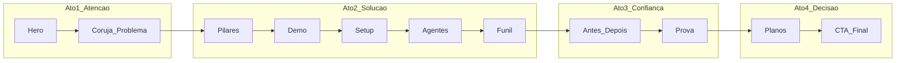

# KORUVISION — Planejamento Mestre da Landing (V3)

## Contexto do projeto

**Stack atual:** Next.js 15 · Lenis (scroll suave) · GSAP + ScrollTrigger · `@react-three/fiber` (protagonistas 3D CSS) · WebP image sequences (`FrameScrubber`) · vídeos MP4 ambiente (`SmartVideo`).

**Arquivos âncora:**
- Ordem da página: [`app/page.tsx`](app/page.tsx)
- Copy e dados: [`config/landing-v10.ts`](config/landing-v10.ts)
- Assets por cena: [`config/nv11-assets.ts`](config/nv11-assets.ts)
- Cenas v10: [`sections/v10/scenes.tsx`](sections/v10/scenes.tsx)
- Coreografia S02→S03: [`lib/scene-choreography.ts`](lib/scene-choreography.ts)
- Docs legados (19 cenas): [`docs/KORUVISION-Protagonists-Matrix.md`](docs/KORUVISION-Protagonists-Matrix.md) — referência, não reflete o corte enxuto atual

**Decisões aprovadas neste planejamento:**
- Persona **B2B genérica** com cases multi-vertical (saúde, imóveis, consultoria, agências, e-commerce)
- **Remover** `LogoIntroSequence` — primeira visita vai direto à Hero
- Manter fluxo enxuto de **10 seções + CTA** (já em [`app/page.tsx`](app/page.tsx)), refinando protagonistas e gaps vs. spec premium

---

## Pilares da landing page

Estes pilares governam copy, visual e CTAs de todas as seções:

| Pilar | Definição | Como aparece na página |
|-------|-----------|------------------------|
| **1. Visão que vende** | A KORUVISION "vê" o que a equipe não vê — leads, intenção, risco de perda | Coruja/olho (S02), hero com CRM vivo, narrativa de clareza |
| **2. Caos → método** | Dor operacional real (WhatsApp solto, funil cego) transformada em fluxo único | S03 Problema → S04 Pilares → S05 Demo |
| **3. Produto tangível** | Não é promessa abstrata — é inbox, IA, pipeline e setup em minutos | Demo 5 atos + Agentes + Funil + Setup |
| **4. Prova antes do preço** | Confiança via transformação visual + números + depoimentos antes de planos | Antes/Depois + Prova unificada |
| **5. Fricção zero na decisão** | 14 dias grátis, sem cartão, setup rápido, plano Pro como âncora | Setup + Planos + CTA final |

**Arco narrativo (4 atos):**



**Hierarquia de CTAs (funil):**
1. Primário: `Começar grátis — 14 dias` → `#s-cta-eco`
2. Secundário: `Ver o produto em ação` → `#s04` (Demo)
3. Terciário: `Ver planos` → `#cena-planos`

---

## Mapa de seções — especificação completa

### S00 — Remoção da Intro (mudança estrutural)

| Campo | Especificação |
|-------|---------------|
| **Objetivo** | Eliminar barreira antes do valor; usuário vê proposta em <2s |
| **Mensagem** | N/A (seção removida) |
| **Protagonista** | N/A |
| **Tecnologia** | Remover wrapper [`LogoIntroSequence`](components/intro/LogoIntroSequence.tsx) de [`app/page.tsx`](app/page.tsx); manter pré-carregamento de assets S02 em `useEffect` da página ou no `ExperienceShell` |
| **Interações** | Nenhuma |
| **Conversão** | Reduz bounce inicial; Hero assume primeiro impacto |

**Implementação:** children de `ExperienceShell` começam em `SectionHero`; lógica `data-koru-intro` em [`SectionHero.tsx`](sections/SectionHero.tsx) pode ser simplificada.

---

### S01 — Hero · Despertar (`#s01`)

| Campo | Especificação |
|-------|---------------|
| **Objetivo** | Capturar atenção, comunicar proposta de valor e oferecer CTA primário imediato |
| **Mensagem** | *"O CRM que vê cada lead e fecha por você"* — plataforma viva, não planilha |
| **Protagonista** | **Núcleo KoruVision** — orbe IA + mockup CRM (`HeroCinematicStack` / `ProductCommandCenter`) à direita; copy à esquerda |
| **Tecnologia** | **Híbrido HYB:** GSAP pin (`usePinSection`, ~160vh) + `SectionMediaLayers` (BG WebP + loop MP4 opacity 0.18) + F2F `NV11-F2F-000` via scrub + mockup React (`GoldenUI`) + tilt/parallax mouse (`hero-choreography.ts`) |
| **Interações** | Scroll: orbe escala/revela CRM; mouse: tilt 3D, luz dinâmica `--light-x/y`; CTAs magnéticos; palavras do headline com stagger |
| **Conversão** | Clique **Começar grátis** ou scroll para **Ver produto** (`#s04`); estabelecer desejo e credibilidade premium |

**Gap atual vs. alvo:** docs especificam `KoruVisionCore.tsx` com partículas canvas — hoje usa stack hero existente. **Fase 2:** elevar orbe para spec Deep (partículas + filamentos) sem aumentar pin.

**Pin alvo:** 160vh desktop / 135vh mobile ([`C01` em nv11-assets](config/nv11-assets.ts))

---

### S02+S03 — Coruja + Problema (`OwlChaosFlow`, pin único ~210vh)

Bloco unificado em [`sections/OwlChaosFlow.tsx`](sections/OwlChaosFlow.tsx) — **não são duas seções de scroll independentes**.

#### S02 — Visão (`#s02-vision`, fase owl)

| Campo | Especificação |
|-------|---------------|
| **Objetivo** | Metáfora de marca: "visão" da KORUVISION enxerga o caos que o usuário ignora |
| **Mensagem** | Algo está errado na operação — a plataforma *vê* antes de você |
| **Protagonista** | **Olho mecânico da coruja** — pupila em `50% 42%` |
| **Tecnologia** | **F2F image sequence** `NV11-F2F-001` (120 WebP @ 30fps) via [`FrameScrubber`](components/motion/FrameScrubber.tsx) + overlay atmosférico roxo/laranja + zoom pupila (`visionBridgeVideoExit` em scene-choreography) |
| **Interações** | Scroll scrub frame-a-frame; saída: túnel/íris na pupila; sem hover crítico |
| **Conversão** | Tensão + curiosidade; prepara identificação com a dor (S03) |

#### S03 — Problema (`#cena-problema`, fase reveal/scene)

| Campo | Especificação |
|-------|---------------|
| **Objetivo** | Nomear a dor e quantificar perda (urgência emocional + racional) |
| **Mensagem** | *"Seus leads esfriam na névoa operacional"* — caos visível, prejuízo subindo |
| **Protagonista** | **Dashboard de caos operacional** — card unificado com: WhatsApp inbox caótico + [`ChaosLossCounter`](components/hero/ChaosLossCounter.tsx) (R$/min) + [`ChaosSlaBadge`](components/hero/ChaosSlaBadge.tsx) (0m→N sem resposta) + gráfico/funil quebrados |
| **Tecnologia** | **LIVE + 3D CSS:** [`OperationalChaos3D`](components/hero/OperationalChaos3D.tsx) + GSAP counters/ticks + íris reveal (`problemSceneEnterWithIris`) + pin embutido no fluxo unificado |
| **Interações** | Scroll: íris abre, mockup rise, rachadura tardia (`SHATTER_ON`); hover em painéis/bubbles; contadores sobem com scroll + ticks ao vivo |
| **Conversão** | CTA **Quero sair do caos** → `#s-cta-eco`; usuário se reconhece na dor |

**Gap:** frames WebP `NV11-F2F-001` precisam existir (`npm run f2f:owl`). Protagonista S03 nos docs era "fragmentos 3D" — implementação atual (mockup LIVE) é **mais conversiva**; manter e polir.

**Pin alvo:** 210vh desktop / 175vh mobile (`OWL_CHAOS_FLOW_PIN_VH`)

---

### S04 — Pilares · A virada (`#cena-pilares`)

| Campo | Especificação |
|-------|---------------|
| **Objetivo** | Apresentar framework da solução em 4 blocos memoráveis |
| **Mensagem** | *"Quatro pilares substituem quatro dores"* — método substitui caos |
| **Protagonista** | **Monólito quatro pilares** — [`FourPillars3D`](components/3d/nv11/protagonists.tsx) |
| **Tecnologia** | **3D CSS** em `ProtagonistStage` + `SceneCinemaSection` pin 95vh + BG WebP + loop `pillarsPulse` (opacity ambiente) + scroll acende pilares em sequência |
| **Interações** | Scroll: pilares erguem/acendem; mouse: tilt hub central (via `usePointerParallax` no stage) |
| **Conversão** | CTA **Ver como funciona** → `#s04` (Demo); ponte dor → produto |

---

### S05 — Demo · Cinco atos (`#s04`)

| Campo | Especificação |
|-------|---------------|
| **Objetivo** | Provar que o produto funciona de ponta a ponta num único fluxo |
| **Mensagem** | *"Do primeiro oi no WhatsApp ao deal fechado"* — substitui seções isoladas de Inbox, Automação e Analytics |
| **Protagonista** | **Sequência CRM despertar** — 5 mockups em camera rig: WA → IA → Kanban → Agenda → Dashboard |
| **Tecnologia** | **Híbrido HYB:** [`SectionDemo`](sections/SectionDemo.tsx) pin 185vh + GSAP camera rig (`CAM[]`) + F2F `NV11-F2F-002` ambiente + `MacInboxMockup` / `MacAutomationMockup` / `UIKanbanBoard` / `UICalendarView` / `MacMetricsMockup` |
| **Interações** | Scroll: 5 atos com scrub; labels de capítulo; possível sticky progress indicator (Fase 2); CTA visível a partir do ato 3 |
| **Conversão** | **Quero esse fluxo na minha operação**; desejo de replicar o fluxo na própria operação |

**Gap:** mockups são genéricos (`GoldenUI`). **Fase 3 (com material do usuário):** substituir por prints/vídeo real do software.

---

### S06 — Setup · 5 minutos (`#cena-setup`)

| Campo | Especificação |
|-------|---------------|
| **Objetivo** | Destruir objeção "é difícil / demora / precisa de consultoria" |
| **Mensagem** | *"No ar em 5 minutos"* — WhatsApp + IA + importação |
| **Protagonista** | **Três portais de conexão** — [`OnboardingPortals3D`](components/3d/nv11/protagonists.tsx) + widget [`SetupVisual`](components/scenes/SceneWidgets.tsx) |
| **Tecnologia** | **3D CSS** pin 90vh + loop `portalsFlow` + steps de `SETUP_STEPS` em landing-v10 |
| **Interações** | Scroll: energia sobe spine entre portais; hover em portais (tilt) |
| **Conversão** | **Conectar meu WhatsApp** → `#s-cta-eco`; reduz medo de implementação |

---

### S07 — Agentes IA (`#cena-agentes`)

| Campo | Especificação |
|-------|---------------|
| **Objetivo** | Diferencial #1 — IA que qualifica e vende com voz da marca |
| **Mensagem** | *"Vendem como seu melhor closer"* — 24/7, score, handoff humano |
| **Protagonista** | **Hub neural** — [`NeuralBrainHub3D`](components/3d/nv11/protagonists.tsx) + [`AgentsVisual`](components/scenes/SceneWidgets.tsx) (mockups IA + inbox) |
| **Tecnologia** | **3D CSS** pin 100vh + `NeuralFlowCanvas` + loop `neuralPulse` + BG `neuralField` |
| **Interações** | Scroll: nodes acendem em ordem; mouse: partículas atraídas ao cursor; hover em nodes |
| **Conversão** | **Criar meu agente** → `#s-cta-eco`; desejo de automação inteligente |

---

### S08 — Funil / Pipeline (`#cena-funil`)

| Campo | Especificação |
|-------|---------------|
| **Objetivo** | Diferencial #2 — visibilidade comercial e previsão de receita |
| **Mensagem** | *"Cada deal avança com gravidade própria"* — pipeline sem furos |
| **Protagonista** | **Vórtice pipeline magnético** — [`SalesPipeline3D`](components/3d/nv11/protagonists.tsx) + deal "Maria" em movimento |
| **Tecnologia** | **3D CSS** pin 100vh + loop `funnelOrbs` + MotionPath GSAP no scroll |
| **Interações** | Scroll: deal percorre estágios; mouse: snap magnético simulado entre colunas |
| **Conversão** | **Organizar meu pipeline** → `#s-cta-eco` |

---

### S09 — Antes / Depois (`#cena-antes-depois`)

| Campo | Especificação |
|-------|---------------|
| **Objetivo** | Contraste emocional — mesmo negócio, dois futuros |
| **Mensagem** | *"Dois universos"* — escuro vs. método KORUVISION |
| **Protagonista** | **Divisor de universos** — [`BeforeAfterSplit3D`](components/3d/nv11/protagonists.tsx) + slider [`BeforeAfterVisual`](components/scenes/SceneWidgets.tsx) |
| **Tecnologia** | **3D CSS + interação LIVE** pin 100vh + loop `splitMist` + drag range input |
| **Interações** | **Drag horizontal** no divisor (principal); scroll: reveal das listas before/after |
| **Conversão** | **Quero o depois** → `#cena-planos`; usuário se projeta no estado desejado |

---

### S10 — Prova unificada (`#cena-prova`) — NOVA estrutura

| Campo | Especificação |
|-------|---------------|
| **Objetivo** | Credibilidade social + resultados por vertical (substitui Cases + Social + faixa Integrações) |
| **Mensagem** | *"Resultados que falam por si"* — números + depoimentos + mercados |
| **Protagonista** | **Totens verticais** — [`VerticalTotems3D`](components/3d/nv11/protagonists.tsx) + painel [`ProofVisual`](components/scenes/SceneWidgets.tsx) (stats, 2 quotes, chips integração) |
| **Tecnologia** | **3D CSS + LIVE** pin 115vh + loop `trustGather` + dados de `SOCIAL_STATS`, `TESTIMONIALS`, `CASES` |
| **Interações** | Scroll: parallax nos totens; hover: pulse em métricas; stats com `data-ambient-breathe` |
| **Conversão** | **Ver planos** → `#cena-planos`; transferência de confiança antes do preço |

**Material futuro:** logos reais de clientes, métricas auditáveis, vídeo depoimento (opcional Fase 3).

---

### S11 — Planos (`#cena-planos`)

| Campo | Especificação |
|-------|---------------|
| **Objetivo** | Apresentar oferta com âncora no plano **Pro** e FAQ de objeções |
| **Mensagem** | *"14 dias grátis, sem cartão"* — Starter / Pro / Agency |
| **Protagonista** | **Monólitos de pricing** — [`PricingMonoliths3D`](components/3d/nv11/protagonists.tsx) + [`PlansVisual`](components/scenes/SceneWidgets.tsx) (cards + FAQ) |
| **Tecnologia** | **3D CSS + LIVE** pin 100vh + loop `decisionRings` + GSAP Flip para toggle mensal/anual (Fase 2 — corrigir D8 do audit) |
| **Interações** | Hover: glow no Pro; scroll: monólitos flutuam; FAQ accordion; toggle preço (sem quebrar DOM) |
| **Conversão** | Assinar **Pro** (âncora visual); Agency para agências via card dedicado |

---

### S12 — CTA Final (`#s-cta-eco`)

| Campo | Especificação |
|-------|---------------|
| **Objetivo** | Fechamento emocional + ação imediata |
| **Mensagem** | *"Coloque o CRM para vender com IA"* — último empurrão |
| **Protagonista** | **Convergência dourada** — [`ProceduralOwlScene`](components/motion/ProceduralOwlScene.tsx) + `OwlSigil` + `MacMetricsMockup` |
| **Tecnologia** | **Híbrido HYB** pin 130vh + F2F `NV11-F2F-004` (quando disponível) + GSAP fade copy on scroll |
| **Interações** | Scroll: owl intensifica; CTAs magnéticos primário + ghost |
| **Conversão** | **Começar grátis — sem cartão** (conversão final) |

---

## Seções removidas (e por quê)

| Seção removida | Absorvida por |
|----------------|---------------|
| Inbox, Automações, Analytics | Demo (5 atos) + Pilares |
| Benefícios | Pilares + Antes/Depois |
| Cases + Social (separados) | Prova unificada (S10) |
| Integrações (seção) | Chips em ProofVisual + copy Demo/Planos |
| Agência (seção) | Plano Agency em Planos |
| Logo Intro (S00) | Removida por decisão — Hero direto |

---

## Padrões técnicos transversais (performance)

- **Scroll:** Lenis + ScrollTrigger via `document.documentElement` ([`usePinSection`](lib/hooks/useGsapContext.ts))
- **Pin budget total alvo:** ~1.350vh desktop (vs. ~2.800vh na versão 19 cenas)
- **Regra protagonista:** nenhuma seção só com BG estático; loop MP4 sempre opacity ≤0.35 como ambiente
- **Mobile:** pins −35% (`pinMobileVh`); desligar partículas pesadas; `prefers-reduced-motion` respeitado em counters/GSAP
- **Assets críticos pendentes:** frames `NV11-F2F-001`, vídeos loop em `/public/assets/nv11/videos/`

---

## Organização do repositório (antes de implementar)

Criar **fonte única de verdade** após aprovação:

```
docs/LANDING-STRATEGY-V3.md     ← este plano exportado
config/landing-strategy.ts      ← metadados por seção (id, pin, protagonist, tech, cta)
```

Atualizar referências cruzadas em `landing-v10.ts` (comentário no topo: "11 seções, ver LANDING-STRATEGY-V3").

**Não alterar** os 19-scene docs legados — arquivar nota "superseded by V3" no topo.

---

## Fases de implementação (após aprovação)

### Fase 0 — Estrutura (1 PR)
- Remover `LogoIntroSequence` de `page.tsx`; simplificar `SectionHero` intro-skip
- Criar `docs/LANDING-STRATEGY-V3.md` + `config/landing-strategy.ts`
- Validar build e scroll ida/volta S02→S03→Pilares

### Fase 1 — Polimento das seções existentes (2 PRs)
- S03: garantir frames F2F + polish counters
- S05 Demo: progress indicator + CTA sticky após ato 2
- S09–S12: FAQ toggle Planos, handoffs de cor entre seções

### Fase 2 — Protagonistas premium (3 PRs, por prioridade)
1. S01 Hero — `KoruVisionCore` / partículas conforme Deep Spec
2. S05 Demo — camera rig + F2F-002 completo
3. S07–S08 — neural hub + pipeline motion path refinados

### Fase 3 — Material real do produto (depende do usuário)
- Prints/vídeos das telas reais substituindo `GoldenUI` na Demo e Agentes
- Logos e métricas reais na Prova
- Depoimentos em vídeo (opcional)

---

## Materiais solicitados (para Fase 3)

Para narrativa mais precisa, enviar quando disponível:
- Screenshots ou gravações: inbox, agente IA, kanban, automações, dashboard
- 2–3 cases com métricas reais e permissão de uso
- URL do fluxo de signup / trial
- Confirmação de preços atuais (Starter R$97 / Pro R$197 / Agency R$497)
